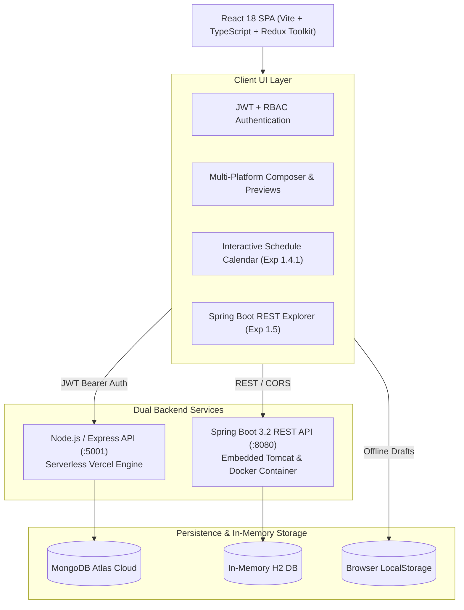
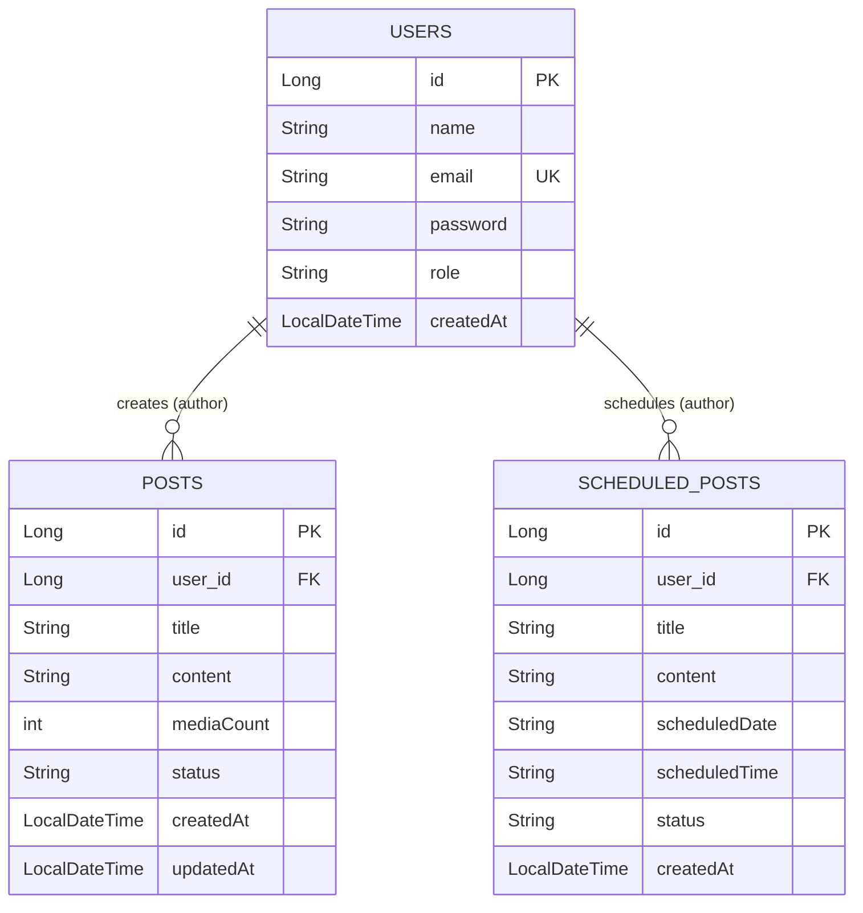

# SocialComposer - Enterprise Social Media Post Composer & RESTful Platform

[](https://fullstack2-postcomposer.vercel.app)
[](https://react.dev/)
[](https://www.typescriptlang.org/)
[](https://redux-toolkit.js.org/)
[](https://spring.io/projects/spring-boot)
[](https://openjdk.org/)
[](https://www.docker.com/)

**SocialComposer** is a full-stack social media orchestration platform built through a progressive sequence of enterprise software engineering experiments. It integrates a modern React frontend, Redux Toolkit state management, dual backends (Node.js/Express & Spring Boot 3.2), and multi-architecture Docker containerization.

- **Live Production URL**: [https://fullstack2-postcomposer.vercel.app](https://fullstack2-postcomposer.vercel.app)
- **REST API Explorer**: [https://fullstack2-postcomposer.vercel.app/api-docs](https://fullstack2-postcomposer.vercel.app/api-docs)
- **GitHub Repository**: [https://github.com/eshaansharma07/fullstack2_24bai70387](https://github.com/eshaansharma07/fullstack2_24bai70387)

---

## 🏛️ High-Level System Architecture



---

## 📑 Curriculum Experiments Overview

### Experiment 1: Multi-Platform Post Composer
- Compose posts with title, content, hashtags, and media attachments.
- Target platforms: **X (Twitter)**, **Facebook**, **Instagram**, and **LinkedIn**.
- Interactive feed mockups matching real social platform previews.
- Client-side and server-side validation against platform limits.
- MongoDB Atlas cloud persistence.

### Experiment 2: Frontend Draft Management System
- CRUD operations for local draft handling.
- Asynchronous UI state workflows with mock API delays.
- Offline persistence using browser `localStorage`.
- Normalized collections using Redux Toolkit `ids` and `entities`.

### Experiment 3: Centralized Redux Toolkit State Architecture
- Single immutable Redux store with slices: `authSlice`, `postsSlice`, `platformsSlice`.
- Async thunks for draft saving, loading, post publishing, and authentication.
- Memoized selectors to eliminate unnecessary component re-renders.

### Experiment 1.4.1: Interactive Content Schedule Calendar
- Monthly visual calendar view with date cells, today highlights, and time-ordered cards.
- Support for scheduling future posts with ISO date (`YYYY-MM-DD`) and 24h time (`HH:mm`) validation.
- Switch between interactive calendar grid and chronological list view.
- Reschedule and cancel controls with live UI updates.

### Experiment 1.4.2: Frontend Performance Optimization & Vitest Suite
- **$O(1)$ Hash Map Lookups**: Day-based indexing for instant calendar cell post rendering without array scanning.
- **`React.memo` & `useCallback`**: Prevents cascading re-renders during high-frequency typing.
- **Vitest & React Testing Library**: Full automated test suite (auth, posts, and calendar components).

### Experiment 1.5 & 2.1.1: Spring Boot RESTful APIs & Layered Architecture
- Built in accordance with enterprise backend standards (inspired by `amansekhon888/spring-boot-lab`).
- **4-Layer Architecture**:
  - `controller/`: `PostController`, `ScheduleController`, `AuthController`, `HelloController`.
  - `service/`: `PostService`, `ScheduleService`, `ValidationService` with platform rule algorithms.
  - `repository/`: `PostRepository`, `ScheduleRepository`, `UserRepository` (Spring Data JPA).
  - `entity/`: `User` table, `Post` table, `ScheduledPost` table.
  - `constants/`: `Platform`, `PostStatus`, `UserRole` enums.
- **Relational Foreign Key**: `Post` and `ScheduledPost` map to `User` via foreign key `user_id` (`@ManyToOne` / `@JoinColumn`), enabling author tracking across multiple users.
- **Jakarta Bean Validation**: Declarative constraints (`@Valid`, `@NotBlank`, `@Size`, `@NotEmpty`, `@Pattern`).
- **Standardized Response Envelope**: Uniform `ApiResponse<T>` structure (`success`, `message`, `data`, `statusCode`, `timestamp`, `errors`).
- **Centralized Exception Handling**: `@RestControllerAdvice` (`GlobalExceptionHandler`).
- **Documentation & Tools**: Springdoc OpenAPI Swagger UI (`/swagger-ui.html`) and H2 Console (`/h2-console`).

---

## 🗄️ Database Entity-Relationship Diagram



---

## 🎨 Modern SaaS Authentication Experience (Redesigned)

The login portal features an enterprise SaaS design system:
- **Palette**: Deep Charcoal (`#101918`), Emerald Green (`#16A765`), Very Light Mint (`#EAF8F1`), and Off-White (`#F8FAF9`).
- **55/45 Split Layout**:
  - **Left Hero**: Bold headline *"Secure Access for Every Role."*, 3 core feature rows with mint icons, 3D stacked isometric role illustration with orbital green nodes, and bottom metric stats (`3 User Roles` | `100% Secure Access` | `24/7 Activity Monitoring`).
  - **Right Card**: Floating card with compact 3-option role selector (Admin, Editor, Viewer), email/password inputs with toggleable password visibility, functional Remember Me, and JWT submission.
- **One-Click Role Presets**: Clicking **Admin**, **Editor**, or **Viewer** updates credentials and role permissions instantly.

---

## 🔑 Demo Account Credentials

| Role | Email | Password | Permissions |
|---|---|---|---|
| **Admin** | `admin@social.com` | `admin123` | Full Access (Compose, Publish, History, Calendar, Admin, REST API) |
| **Editor** | `editor@social.com` | `editor123` | Compose, Publish, History, Calendar |
| **Viewer** | `viewer@social.com` | `viewer123` | Read-only (History, Calendar, REST API) |

---

## 🐳 Docker Containerization

The Spring Boot backend is containerized using a multi-stage Dockerfile compatible with Apple Silicon (`linux/arm64`) and x86_64 (`linux/amd64`):

```bash
# 1. Start the container in detached mode
docker compose up -d

# 2. Check running status in Docker Desktop
docker ps

# 3. View live server logs
docker logs -f socialcomposer-springboot-api

# 4. Stop the container
docker compose down
```

Once running:
- **Hello World**: [http://localhost:8080/hello](http://localhost:8080/hello)
- **Swagger UI**: [http://localhost:8080/swagger-ui.html](http://localhost:8080/swagger-ui.html)
- **H2 Database Console**: [http://localhost:8080/h2-console](http://localhost:8080/h2-console) (JDBC: `jdbc:h2:mem:socialcomposerdb`, User: `sa`, Password: `password`)
- **Actuator Health**: [http://localhost:8080/actuator/health](http://localhost:8080/actuator/health)

---

## 💻 Local Development Setup

### 1. Install Node Dependencies
```bash
npm install
```

### 2. Configure Environment Variables
Create `server/.env`:
```env
PORT=5001
MONGODB_URI=your_mongodb_connection_string
JWT_SECRET=super_secure_jwt_secret_key_12345
```

### 3. Run Development Servers
```bash
# Run both client and express server
npm run dev

# Or run client only
npm run dev --workspace=client
```

### 4. Run Test Suite
```bash
npm test --workspace=client
```

---

## 📂 Directory Structure

```text
.
├── client/                     # React 18 + Vite + Redux Toolkit Frontend
│   ├── src/
│   │   ├── components/
│   │   │   ├── Auth/           # Redesigned SaaS Login (AuthPanel.tsx, AuthPanel.css)
│   │   │   ├── Calendar/       # Content Scheduler Calendar (Exp 1.4.1)
│   │   │   ├── Layout/         # AppLayout, Navbar, Navigation Links
│   │   │   ├── Pages/          # Dashboard, Compose, History, Admin, ApiDocsPage
│   │   │   └── PostComposer/   # Composer Card, Platform Selectors, Live Previews
│   │   ├── store/              # Redux Toolkit (authSlice, postsSlice, platformsSlice)
│   │   └── types.ts            # TypeScript interfaces
├── server/                     # Express Node.js API with JWT & MongoDB
│   └── src/
│       ├── server.ts           # REST endpoints, JWT verification, CORS
│       └── db.ts               # Database CRUD and Schedule models
├── springboot-server/          # Spring Boot 3.2 Java 17 Backend
│   ├── pom.xml                 # Maven configuration & starter dependencies
│   ├── Dockerfile              # Multi-stage multi-arch container build
│   └── src/main/java/com/socialcomposer/api/
│       ├── config/             # CorsConfig, OpenApiConfig, DataInitializer
│       ├── constants/          # Platform, PostStatus, UserRole enums
│       ├── controller/         # PostController, ScheduleController, AuthController
│       ├── dto/                # Request & Response DTOs with Bean Validation
│       ├── entity/             # User, Post, ScheduledPost entities (JPA & FKs)
│       ├── exception/          # GlobalExceptionHandler (@RestControllerAdvice)
│       ├── repository/         # PostRepository, ScheduleRepository, UserRepository
│       └── service/            # PostService, ScheduleService, ValidationService
├── docker-compose.yml          # Container orchestration for Docker Desktop
├── vercel.json                 # Vercel deployment routing
└── README.md                   # Complete documentation
```

---

## 🚀 Deployment

The client and serverless API endpoints are deployed to Vercel:

```bash
vercel deploy --prod
```

- **Production URL**: [https://fullstack2-postcomposer.vercel.app](https://fullstack2-postcomposer.vercel.app)
